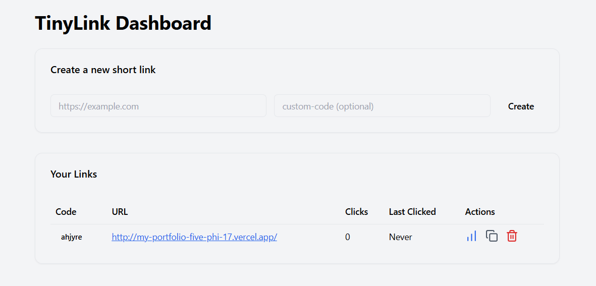

This is a [Next.js](https://nextjs.org) project bootstrapped with [`create-next-app`](https://nextjs.org/docs/app/api-reference/cli/create-next-app).

## Getting Started

First, run the development server:

```bash
npm run dev
# or
yarn dev
# or
pnpm dev
# or
bun dev
```



# TinyLink – URL Shortener

TinyLink is a minimal and functional URL shortening service similar to bit.ly.  
It allows users to create short links, view statistics, delete links, and perform redirects.

This project is built using **Next.js (App Router)**, **Prisma**, **PostgreSQL**, and **Tailwind CSS**.

---

## 📌 Assignment Requirements (Completed)

- ✔ Build a working URL shortener  
- ✔ Use Next.js (as suggested)  
- ✔ Clean UI with proper states  
- ✔ Publish a **live deployed URL**  
- ✔ Public GitHub repository  
- ✔ Provide a demo walkthrough video  
- ✔ Provide ChatGPT transcript  
- ✔ Follow exact API contract and route conventions  
- ✔ Implement Dashboard, Stats page, Redirect route, Health check  

---

# 🚀 Features

### 🔗 URL Shortening  
- Add a long URL  
- Optionally provide a custom short code  
- Validate URL format  
- Code uniqueness enforced (409 on duplicate)

### ↪ Redirect  
- Visiting `/code` → performs **302 redirect**  
- Increments click count  
- Updates last clicked timestamp

### ❌ Delete  
- Delete short links  
- After deletion, `/code` must return **404**

### 📊 Dashboard  
Shows all links with:  
- Code  
- Long URL  
- Total clicks  
- Last clicked  
- Delete action  

### 📈 Stats Page  
`/code/:code` → View:  
- Code  
- Full URL  
- Total clicks  
- Last clicked  

### ❤️ Health Check  
`/healthz` → returns:  
```json
{ "ok": true, "version": "1.0" }

